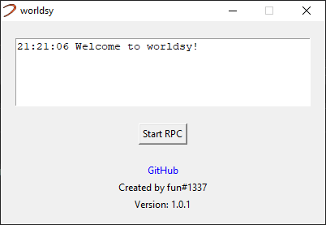

# worldsy
A Discord RPC client for [Worlds](http://worldsonline.com/).

# Why?
Honestly, I was bored...

I was just sitting at GroundZero, chatting, and I know that there is quite a big Discord server for Worlds and this idea popped into my head and I said "Why the heck not.".

I had to jump through some hoops to get this working as well, I had to learn Tkinter! Python isn't even ONE of my favourite languages so I made this while holding back tears.

### Why Python then?
Honestly, it was because it the right tool for the right job.

In the future, I might rewrite this in Rust or something but at the moment, it's fine.

Plus, I'd bet there's more Python developers out there than just about any other language so that's a plus.

### How much time did you spend writing this? 
Around three to four hours, without getting up, without looking away... I need help.

# Usage
1. Download the latest release from the [releases](https://github.com/fuwn/worldsy/releases/latest).
2. Run executable.
3. Click "Start RPC".

## Development
To get started with this project;

1. Clone the repository.
2. Install the dependencies via `pip install -r requirements.txt`.

To build an executable, execute `build.bat`.

Note that this is only tested on Windows 10, there is no guarantee that this will work on other operating systems but be my guest in trying.

## Roadmap
- [Worldsy](https://github.com/fuwn/worldsy/projects/1)
- ~~Worldsy (Rust Re-write)~~

## Notice
All rights go to Worlds.com for the images with the [/assets](./assets) directory.

### License
[MIT](./LICENSE)
